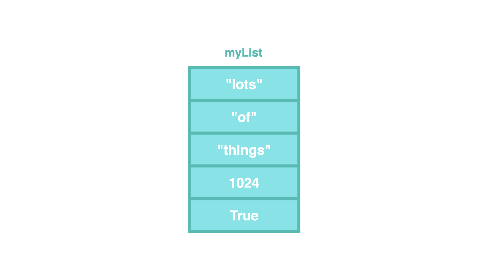
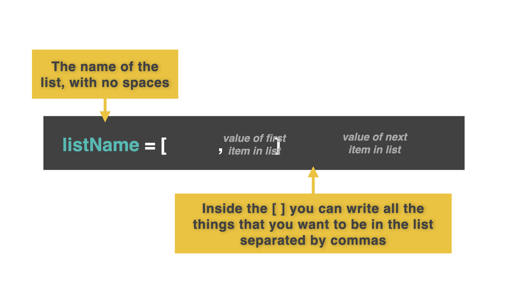
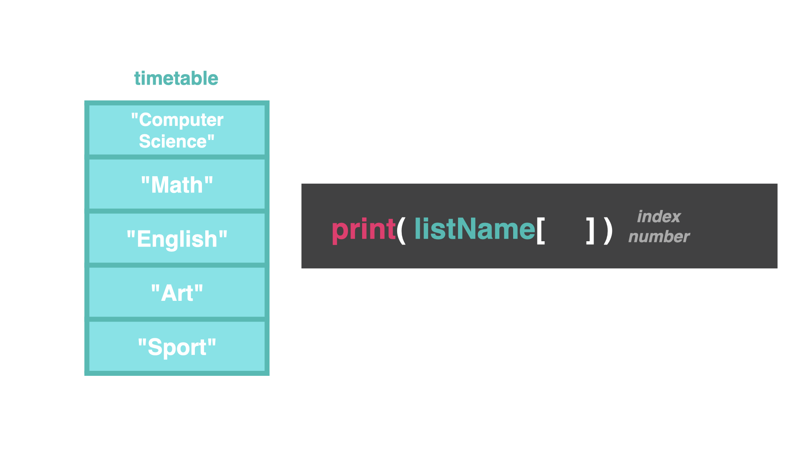

# Lists

In Computer Science, we learn about a data structure called arrays. Arrays are a place to store more than one thing with the same variable name.

However, Python uses **lists** instead. Lists are literally lists of items. Any piece of data from any data type can go into a list. We can extract, remove, or change lists. 


**You may be asking: "What is the point of a list?"**

Sometimes, you don't always know how much data you need to store. We can use a loop to move through data in a list without having to first manually tell the computer how many things are in that list.
## Starting at 0

As far as Python is concerned, this is a list. Notice we start counting the first item at 0 (instead of 1).


Example: In this list, "lots" is index 0, "of" is index 1, etc.


We can directly add to the list with the variable name, `[ ]` with the index number of the row.


## Printing Lists

We can print out data in the same way. 



👉 Let's make a list of our class schedule. 


```python

timetable = ["Computer Science", "Math", "English", "Art", "Sport"]
```
👉 Let's `print` our list:

```python

timetable = ["Computer Science", "Math", "English", "Art", "Sport"]
print(timetable)
```
## Yikes! 
That looks awful with all the `[ ],""` printing too! If I want to print out index 1 in my timetable, I need to tell the computer!



👉 Let's try to `print` math from our list above:

```python

timetable = ["Computer Science", "Math", "English", "Art", "Sport"]
print(timetable[1])
```

Remember, we start counting at 0. So the *second* index, math, is *1*.


### Can you `print` the entire timetable? 


