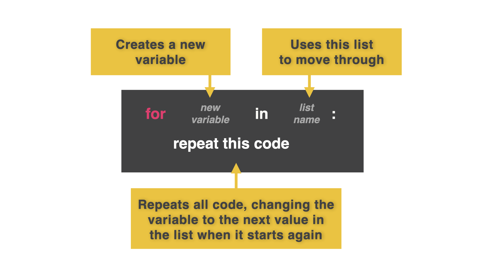

# Lists and Loops

Why would I want to write *all* of those lines of code?

## Introducing lists' best friend...loops




👉 We can replace a lot of those lines of code we just wrote with just two lines of code. Change your code to look like this: 

```python
timetable = ["Computer Science", "Math", "English", "Art", "Watch TV"]
for lesson in timetable:
  print(lesson)
```

Now we have given the computer a list. We said "make `lesson` each value within this list and then do something with it."

<details> <summary> Flashback </summary>

  Remember, `for` loops work by creating the variable right after the word `for` and setting it equal to each value in a list (so far we have only used numbers with the `range` function).

</details>

### Try it out!